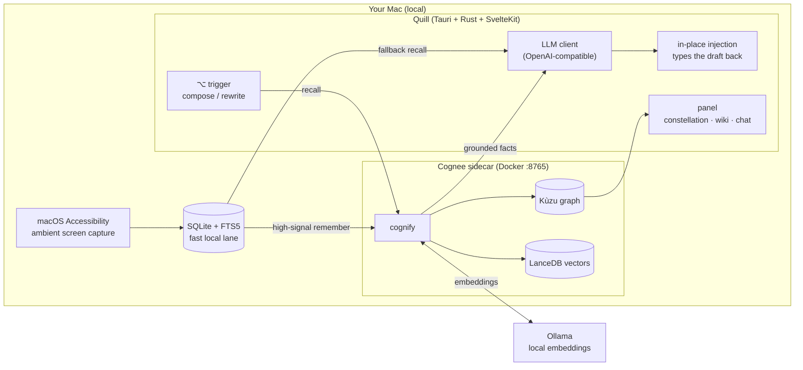

<div align="center">

# 🪶 Quill

### An ambient AI writing assistant with a *real* memory.

**Press `⌥` anywhere — it writes like you, grounded in what you've actually seen.**

Quill watches your screen locally, builds a private knowledge graph of your work with
[**Cognee**](https://github.com/topoteretes/cognee), and drafts or rewrites text *inside the
apps you already use* — in your voice, using facts it remembers. 100% self-hosted. Nothing
leaves your machine unless you point it at a cloud model.

<!-- ─────────────────────────────────────────────────────────────────────────
     DEMO MEDIA — added after recording
     ───────────────────────────────────────────────────────────────────────── -->

**▶️ Demo video:** _coming soon — link goes here_

<!--
| Rewrite in your voice | Cross-app memory recall | The constellation |
|:---:|:---:|:---:|
|  |  |  |
-->

</div>

---

## The problem → the solution

AI writing tools are stateless strangers: you paste context into a chat box every time, they
have no idea who you are or what you've been working on, and they write in a generic voice that
isn't yours. Meanwhile everything you actually need — the decision made in a Teams thread this
morning, how you phrase things on LinkedIn vs. email, the name of that vendor — is scattered
across a dozen apps and gone the moment you switch windows.

**Quill closes that loop.** It captures your work ambiently, distills it into a personal
knowledge graph with Cognee, and puts a single keystroke (`⌥`) in every text field. Press it and
Quill drafts or rewrites *in place* — grounded in your real memory and matched to the voice you
use on that specific surface. The memory is yours: local-first, inspectable as a constellation,
and forgettable one surface at a time.

---

## Features

- **`⌥` rewrite / compose** — one keystroke in any text field. Empty field → it composes;
  existing text → it rewrites — in your **per-platform voice** (email ≠ Slack ≠ LinkedIn).
- **Cross-app memory recall** — drafts are grounded in facts Quill saw *elsewhere*, minutes or
  days ago, that aren't on your screen right now.
- **Mention replies** — detects a pre-filled reply tag / @mention and answers the right person.
- **Quote-aware email replies** — understands the quoted thread below your cursor and replies to
  what was actually asked.
- **Re-roll + `CAPS` revisions** — not happy? press `⌥` again for a new take, or type an
  instruction in `ALL CAPS` (e.g. `MAKE IT SHORTER`) to steer the revision.
- **Edit-delta learning** — when you tweak Quill's output, it learns the correction and writes
  more like you next time.
- **Panel chat / ask** — open the panel to ask questions against your own memory.
- **Constellation graph view** — a live, force-clustered map of the people, orgs, projects, and
  tools in your knowledge graph, distilled into per-entity wiki pages.
- **Pause · exclusions · forget** — pause capture anytime, exclude apps you never want seen, and
  surgically **forget** an entire surface from memory.

---

## How Cognee powers Quill

Quill is built around Cognee's memory lifecycle — this is a Cognee project, and the graph *is*
the product. Quill maps Cognee's four memory verbs directly onto product actions:

| Cognee verb | In Quill | Where |
|---|---|---|
| **`remember`** (`add` + `cognify`) | your authored text, corrections, and cleaned conversation extracts become graph nodes | `remember` on a clean, high-signal feed |
| **`recall`** (`search`) | every draft/chat starts by recalling grounded facts from the graph | leads generation, with a local fallback |
| **`improve`** (`memify`) | the graph self-improves — prunes stale nodes, strengthens frequent ties, derives new facts | nightly / on-demand |
| **`forget`** | excluding an app or surface drops exactly that dataset from memory | one call, no residue |

**Design decisions that make Cognee shine:**

- **A dataset per surface.** Every app/domain (`app-outlook`, `domain-linkedin-com`,
  `corrections`, …) is its own Cognee dataset. This buys **legible provenance** (every recalled
  fact carries where it came from) and **surgical forget** (drop one surface without touching the
  rest).
- **Two-lane ingestion.** A live lane `remember`s authored + high-signal content the moment it
  happens; a self-healing background lane re-converges anything the sidecar dropped under load, so
  the graph is eventually consistent without a firehose of noise.
- **`cognify` → graph + vectors, fully local.** Cognee builds a **Kùzu** knowledge graph and
  **LanceDB** vector store on disk. Embeddings run on local Ollama; extraction runs on any
  OpenAI-compatible LLM you choose.
- **Bench-gated recall under a 10s budget.** Every retrieval strategy has to earn its place in the
  keypress hot path (see [`tools/search-bench.md`](tools/search-bench.md)): Quill ships the
  **`CHUNKS`** strategy (sub-3s: Cognee retrieves, Quill's LLM synthesizes) instead of running a
  second in-graph LLM that blew past the budget. Recall **degrades gracefully** — if the sidecar
  is warming up or busy, Quill falls back to a local full-text lane and never blocks your keypress.
- **100% self-hosted / local.** The sidecar is the public `cognee/cognee` image on
  `127.0.0.1:8765`; the graph, vectors, and (optionally) the LLM all run on your machine.

---

## Architecture



**Flow:** ambient capture → SQLite (fast local memory) → Cognee sidecar (`remember`/`cognify`
into a graph) → `recall` grounds the LLM → the draft is injected back into the focused field.

---

## Quickstart (run it yourself)

### Prerequisites

- **macOS 13+** (Apple Silicon recommended)
- **[Docker Desktop](https://www.docker.com/products/docker-desktop/)** (runs the Cognee sidecar)
- **[pnpm](https://pnpm.io/)**, **[Rust](https://rustup.rs/)**, and the
  [Tauri v2 prerequisites](https://v2.tauri.app/start/prerequisites/)
- **An OpenAI-compatible LLM endpoint** — an OpenAI or [OpenRouter](https://openrouter.ai/) API
  key (fastest), a self-hosted vLLM/Ollama server, or fully local [Ollama](https://ollama.com/)
  (nothing leaves your machine).

### 1. Clone

```bash
git clone https://github.com/BigAchiever/Quill-2.0.git
cd Quill-2.0
```

### 2. Configure the two `.env` files

Quill's drafting LLM and the Cognee sidecar are configured separately. Copy both templates:

```bash
cp quill/src-tauri/.env.example        quill/src-tauri/.env
cp cognee-sidecar/.env.example         cognee-sidecar/.env
```

**`quill/src-tauri/.env`** — Quill's own drafting/chat LLM (OpenAI-compatible chat-completions):

| Variable | What it is |
|---|---|
| `QUILL_LLM_URL` | chat-completions endpoint, e.g. `https://api.openai.com/v1/chat/completions` |
| `QUILL_LLM_KEY` | API key for that endpoint (`ollama` if using local Ollama) |
| `QUILL_LLM_MODEL` | model id, e.g. `gpt-4o-mini` or `qwen2.5:14b` |
| `QUILL_COGNEE_URL` | *(optional)* sidecar base URL — defaults to `http://127.0.0.1:8765/api/v1` |

**`cognee-sidecar/.env`** — the memory engine (uncomment ONE LLM block: OpenAI, local Ollama, or
your own server):

| Variable | What it is |
|---|---|
| `LLM_PROVIDER` / `LLM_MODEL` / `LLM_API_KEY` / `LLM_ENDPOINT` | LLM used by `cognify` to build the graph |
| `EMBEDDING_PROVIDER` / `EMBEDDING_MODEL` / `EMBEDDING_DIMENSIONS` | embeddings (local Ollama `nomic-embed-text` recommended) |
| `GRAPH_DATABASE_PROVIDER` / `VECTOR_DB_PROVIDER` / `DB_PROVIDER` | storage backends (Kùzu / LanceDB / SQLite — leave as-is) |

> 🔒 The `.env` files are gitignored. **Never commit real keys.** Only the `.env.example`
> templates (placeholders only) belong in the repo.

### 3. Start the memory engine

```bash
docker compose up -d
# health check (should return 200 once warm):
curl -s -o /dev/null -w "cognee: HTTP %{http_code}\n" http://127.0.0.1:8765/health
```

### 4. Run Quill

```bash
cd quill
pnpm install
pnpm tauri dev
```

### 5. Grant Accessibility

Quill reads the focused text field and types drafts back, which needs macOS Accessibility:

> **System Settings → Privacy & Security → Accessibility → enable Quill**, then relaunch.

Then press **Right-Option (`⌥`)** in any text field. See [`SETUP.md`](SETUP.md) for the full
walkthrough and troubleshooting.

> 💡 **Want the hero moment in 2 minutes?** With the sidecar running,
> `python3 cognee-sidecar/demo-seed.py` injects one realistic "seen earlier" fact so you can
> watch it travel from memory → graph → your draft.

---

## 🧑‍⚖️ For judges / evaluators

Prefer to run the packaged app (no Rust/pnpm toolchain)? Follow
**[`SETUP-JUDGES.md`](SETUP-JUDGES.md)** — it gets you from install to the `⌥` hero moment in
~10 minutes, with a 2-minute demo and a guide to what makes this a Cognee project.

- **[`SETUP-JUDGES.md`](SETUP-JUDGES.md)** — step-by-step setup for the packaged app
- **[Download `Quill.dmg`](https://github.com/BigAchiever/Quill-2.0/releases/download/v0.1.0/Quill.dmg)** — drag-to-install app bundle (**Apple Silicon**; Intel Macs build from source)

---

## Roadmap

- **Embedded, no-Docker sidecar** — bundle the memory engine so there's zero external dependency.
- **Graph-completion & temporal recall** — richer answers and time-scoped queries once the graph
  is temporally cognified.
- **Approve-before-send delegated replies** — Quill drafts the reply, you approve, it sends.
- **Proactive briefs** — "here's what changed and what needs you" digests from the graph.
- **Windows support.**
- **Encryption at rest** for the local store and graph.
- **Memory steering UI** — pin, boost, and correct what the graph believes.

---

## Tech stack

Tauri v2 · Rust · SvelteKit · [Cognee](https://github.com/topoteretes/cognee)
(Kùzu graph + LanceDB vectors) · Ollama embeddings · SQLite + FTS5 · macOS Accessibility.

## License

[MIT](LICENSE) © 2026 Danish Ali Siddiqui
